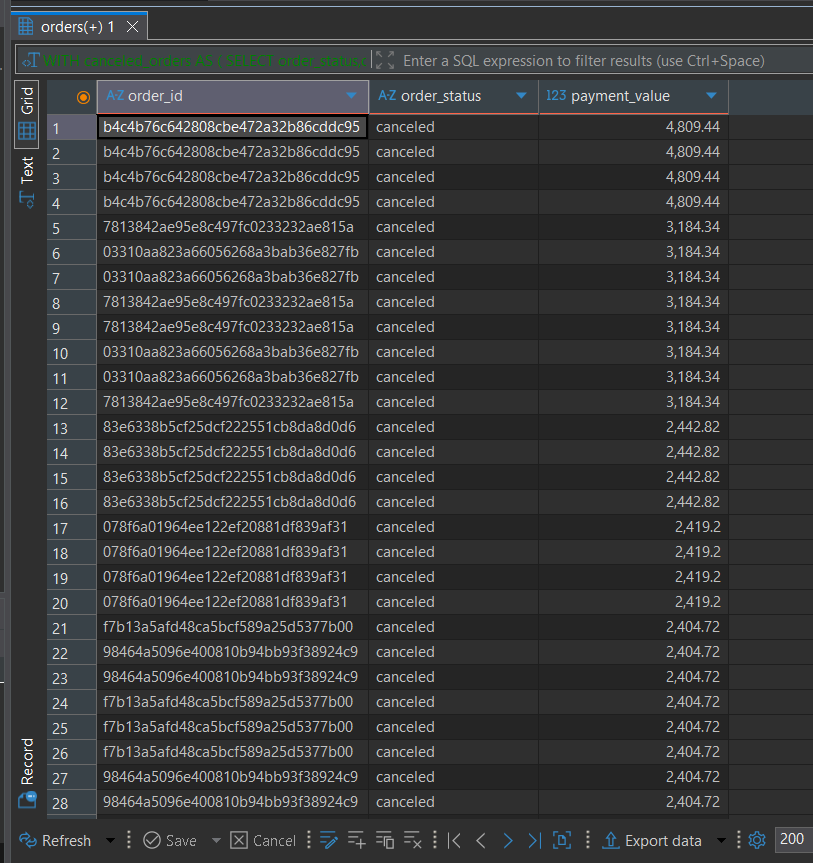
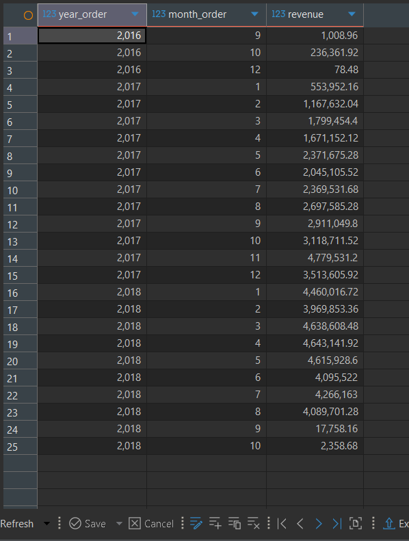
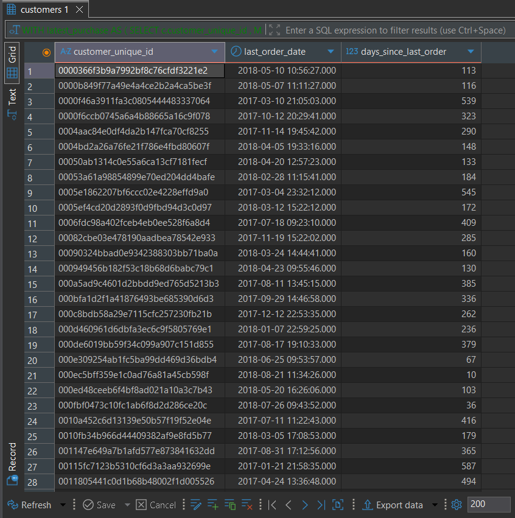
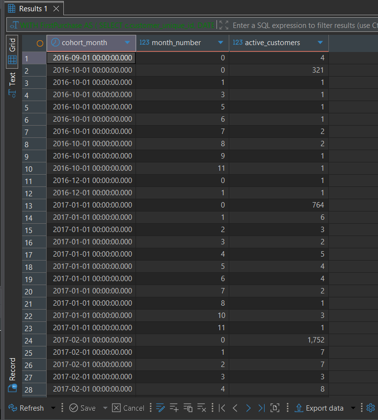
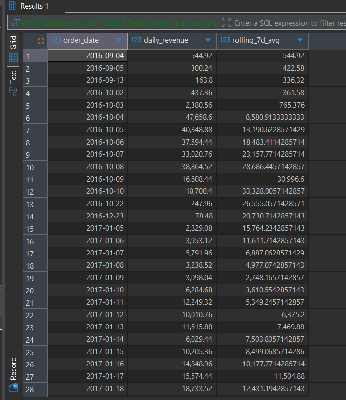

# 🛒 eCommerce Sales Analytics using PostgreSQL

---

## Project Overview

This project performs an end-to-end SQL analysis of an eCommerce marketplace using PostgreSQL.

The goal is to solve real business problems including:

- Revenue Analysis
- Customer Behaviour
- Seller Performance
- Product Analysis
- Order Fulfillment
- Refund Analysis
- Delivery Performance

---

# Dataset

Tables

- Customers
- Orders
- Order Items
- Payments
- Reviews
- Sellers
- Products
- Geolocation

---

# Tech Stack

- PostgreSQL
- SQL
- VS Code
- DBeaver
- Git
- GitHub

---

# SQL Concepts Used

- SELECT
- WHERE
- GROUP BY
- HAVING
- CASE
- CTE
- Window Functions
- Aggregate Functions
- Joins
- Date Functions
- Ranking Functions
- Subqueries

---

# Business Problems Solved

---

## 1. Refund Tracking

### Business Problem
Identify cancelled orders where payment was deducted.

### SQL

```sql

WITH canceled_orders AS (
			SELECT
					order_status,order_id
			FROM 	orders o
			WHERE 	order_status = 'canceled')
SELECT
			canceled_orders.order_id,
			canceled_orders.order_status,
			op.payment_value 
FROM 		canceled_orders
JOIN 		order_payments op ON op.order_id = canceled_orders.order_id
WHERE 		op.payment_value > 0
ORDER BY 	op.payment_value  DESC;
```

### Output



---


## 2. Monthly Revenue Trend

### SQL

```sql

SELECT 
			EXTRACT(YEAR FROM(o.order_purchase_timestamp)) AS year_order,
			EXTRACT(MONTH FROM(o.order_purchase_timestamp))AS month_order,
			SUM(p.payment_value) AS revenue
FROM		orders o
JOIN		order_payments p ON o.order_id = p.order_id
GROUP BY 	EXTRACT(YEAR FROM(o.order_purchase_timestamp)) ,
			EXTRACT(MONTH FROM(o.order_purchase_timestamp))
ORDER BY 	EXTRACT(YEAR FROM(o.order_purchase_timestamp)),
			EXTRACT(MONTH FROM(o.order_purchase_timestamp))ASC;
			
```
### Output



---


## 3. RFM (Recency, Frequency, Monetary) Customer Segmentation

### Business Problem
Classify customers based on their purchasing behavior to identify high-value clients, loyal customers, and those at risk of churning.

### SQL

```sql
WITH latest_purchase AS (			
			SELECT  
						c.customer_unique_id ,
						MAX(o.order_purchase_timestamp) AS last_order_date
			FROM 		orders o 
			LEFT JOIN 	customers c ON c.customer_id = o.customer_id 
			GROUP BY 	c.customer_unique_id 
			)
SELECT
			customer_unique_id,
			last_order_date,
			EXTRACT(DAY FROM ('2018-09-01'::TIMESTAMP - last_order_date)) AS days_since_last_order
FROM 		latest_purchase
;

```
### Output



---


## 4. Cohort Retention Matrix

### Business Problem
Track customer retention month-over-month to understand long-term engagement and platform stickiness after their first purchase.

### SQL

```sql
WITH FirstPurchase AS (
 SELECT
 c.customer_unique_id,
 DATE_TRUNC('month', MIN(o.order_purchase_timestamp)) AS cohort_month
 FROM customers c
 JOIN orders o ON c.customer_id = o.customer_id
 GROUP BY c.customer_unique_id
),
OrderActivity AS (
 SELECT
 f.customer_unique_id,
 f.cohort_month,
 DATE_TRUNC('month', o.order_purchase_timestamp) AS activity_month
 FROM FirstPurchase f
 JOIN customers c ON f.customer_unique_id = c.customer_unique_id
 JOIN orders o ON c.customer_id = o.customer_id
)
SELECT
 cohort_month,
 EXTRACT(MONTH FROM age(activity_month, cohort_month)) AS month_number,
 COUNT(DISTINCT customer_unique_id) AS active_customers
FROM OrderActivity
GROUP BY 1, 2
ORDER BY 1, 2;
```

### Output



---


## 5. 
7-Day Rolling Average of Daily Revenue
### Business Problem 
Smooth out daily volatility in eCommerce sales to identify true underlying trends in revenue over time

### SQL

```sql

WITH DailyRevenue AS (
 SELECT
 DATE(o.order_purchase_timestamp) AS order_date,
 SUM(p.payment_value) AS daily_revenue
 FROM orders o
 JOIN order_payments p ON o.order_id = p.order_id
 GROUP BY DATE(o.order_purchase_timestamp)
)
SELECT
 order_date,
 daily_revenue,
 AVG(daily_revenue) OVER(ORDER BY order_date ROWS BETWEEN 6 PRECEDING AND CURRENT ROW) AS rolling_7d_avg
FROM DailyRevenue
GROUP BY order_date,
 daily_revenue
ORDER BY order_date;
```

### Output



---


# Key Learnings

- Complex Joins
- Business Problem Solving
- SQL Optimization
- Window Functions
- Data Cleaning

---

# Future Improvements

- Power BI Dashboard
- Interactive KPI Dashboard
- Query Optimization
- Stored Procedures

---

# Author

Chirag Kapoor

LinkedIn

GitHub
